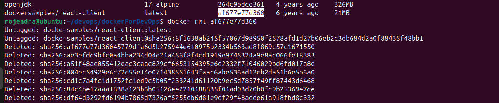

## Build Images
Quickly manage Docker images: build, push, tag, and rmi them.

*Example output of running `build`.*
   - `docker build -t <image-name>`  - "Build image from Dockerfile in current directory"
```bash
   docker build -t mybackend . 

 ```
  
    

*Example output of running `tag`.*
   - ` docker tag old-image newimage:1.0`  - "Rename or version an image"
```bash
    docker tag mybackend:latest rk0617/mybackend:latest
    docker tag mybackend rk0617/mybackend:latest

 ```
  
    

*Example output of running `login`.*
   - `docker login -u <username>`  - "Logged in to your docker hub."
```bash
    docker login -u rk0617 

 ```
  


*Example output of running `push`.*
   - `docker push <image-name>:<image-tag/version>` - "Push image to Docker Hub"
```bash
   docker push rk0617/mybackend:latest
```
  
    


*Example output of running `rmi`.*
   - `docker rmi <image_id> `   "Remove an image"
```bash
   docker rmi af677e77d360 
```
  
   

