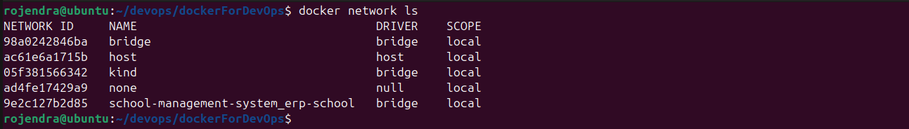
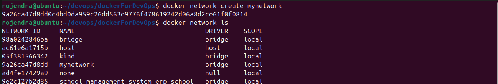
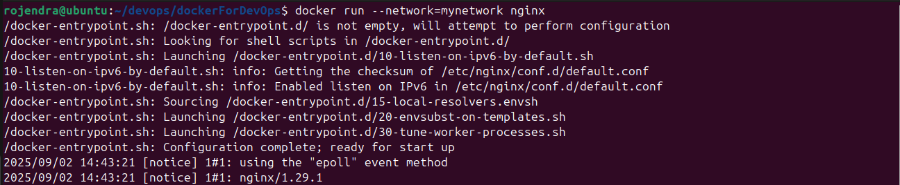
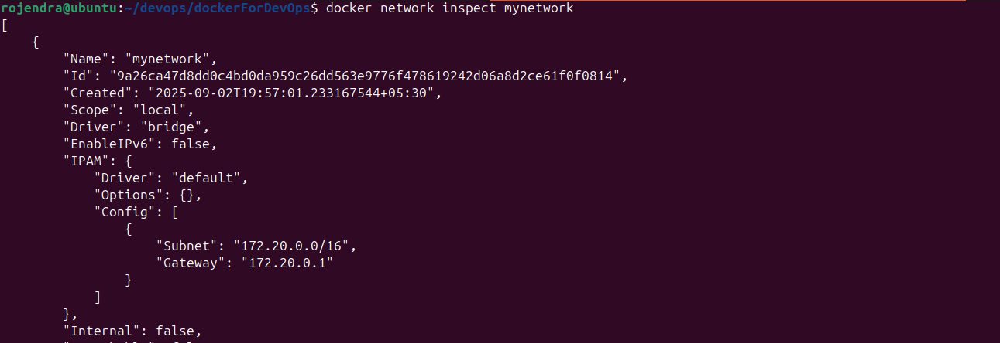
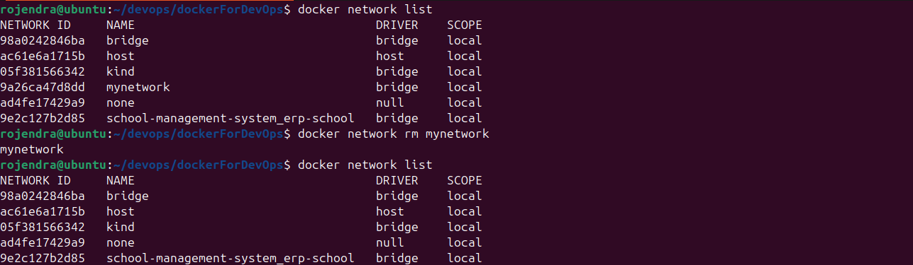

## Docker Network
Quickly manage networks: create, connect, inspect, and remove.

*Example output of running `network ls`.*
   - `docker network ls`  - "List all networks"
```bash
   docker network ls 

 ```
  
    

*Example output of running `create`.*
   - ` docker network create <network-name>`  - "Create a custom network"
```bash
    docker network create mynetwork 

 ```
  
    

*Example output of running `login`.*
   - `docker run --network=mynetwork nginx`  - "Attach container to network"
```bash
    docker run --network=mynetwork nginx

 ```
  


*Example output of running `push`.*
   - `docker network inspect <network-name>` - "Inspect network details"
```bash
   docker network inspect mynetwork

```
  
    


*Example output of running `rmi`.*
   - `docker network rm <network-name>`   "Remove an image"
```bash
   docker network rm mynetwork
```
    

