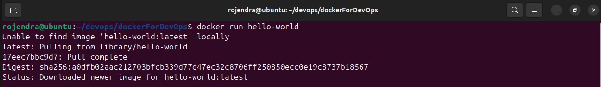
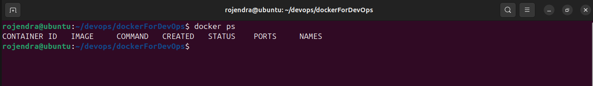
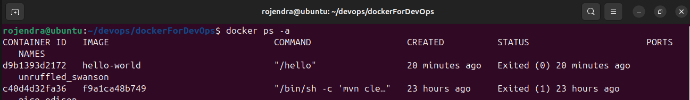
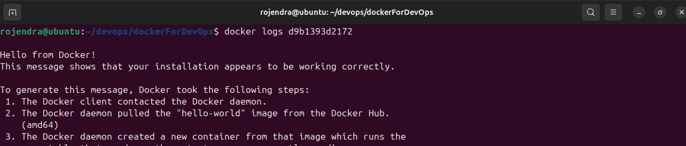
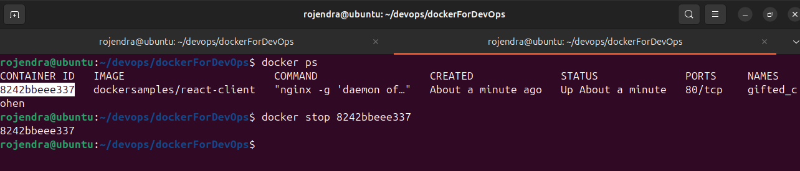
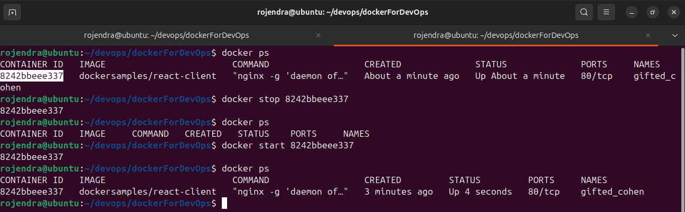
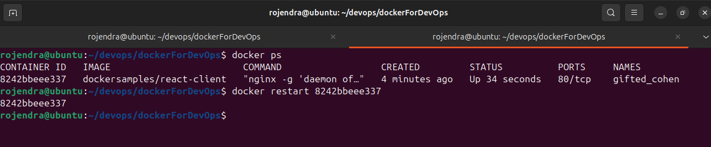
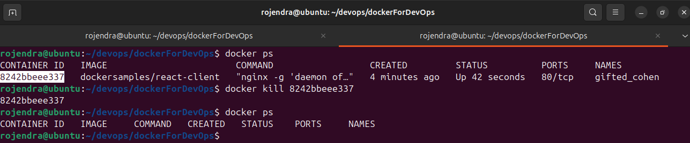
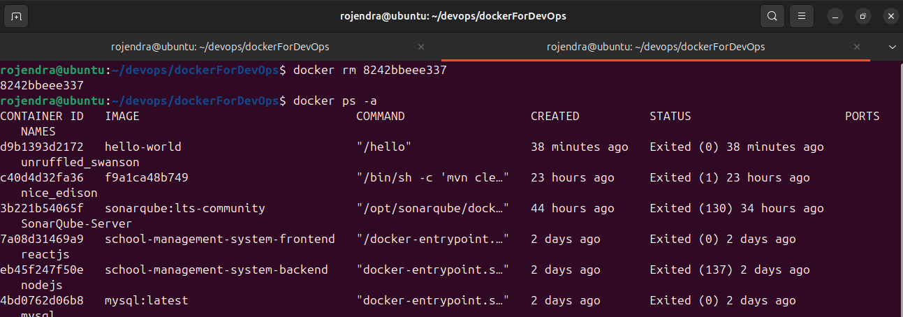
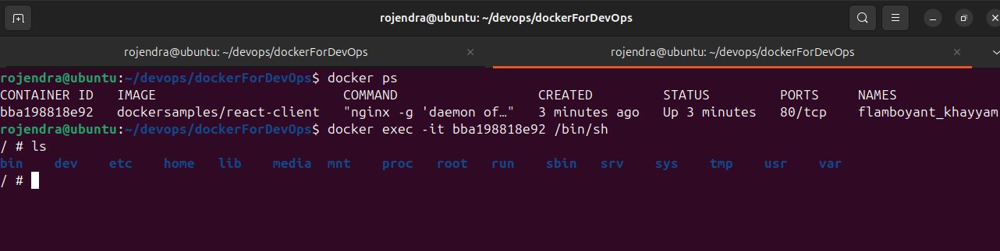

 
## Managing Containers
Easily create, run, stop, and remove containers with these commands:

*Example output of running `hello-world`.*
   - `docker run hello-world`  - "Run a test container if image not preset in local then download from docker registry"
        ```bash
            docker run hello-world
            -- only for download the image
            docker pull hello-world
        ```
     
    

*Example output of running `docker ps`.*
   - `docker ps`   "List of all running containers."
        ```bash
            docker ps
        ```
     
    

*Example output of running `docker ps -a`.*
   - `docker ps -a` - "List **all** containers (including stopped ones)."
        ```bash
            docker ps -a
        ```
     
    

*Example output of running `docker logs.*
  - `docker logs <container_id>` - "View logs of a container."
    ```bash
        docker logs d9b1393d2172
    ```
    


*Example output of running `docker stop`.*
   - `docker stop <container_id>` - "Stop a running container."
        ```bash
            docker stop 8242bbeee337
        ```
     


*Example output of running `docker start`.*
   - `docker start <container_id>` "Start a stopped container."
        ```bash
            docker start 8242bbeee337
        ```
     
  

*Example output of running `docker restart`.*
   - `docker restart <container_id>`  - "Restart a container."
        ```bash
            docker restart 8242bbeee337
        ```
     
    

*Example output of running `docker kill`.*
  - `docker kill <container_id>`  - "Before Remove kill a container."
    ```bash
        docker kill 8242bbeee337
    ```
    
  
*Example output of running `docker rm`.*
   - `docker rm <container_id>`  - "Remove a container."
        ```bash
            docker rm 8242bbeee337
        ```
     
    

*Example output of running `docker exec`.*
   - `docker exec -it <container_id> /bin/bash` - "Access a container’s interactive shell."
        ```bash
            docker exec it bba198818e92 /bin/sh
        ```
     
    

