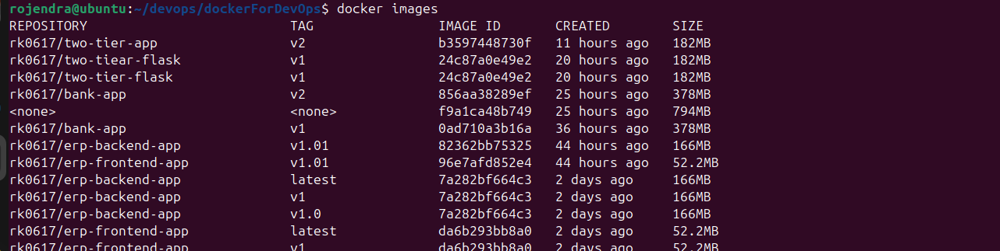
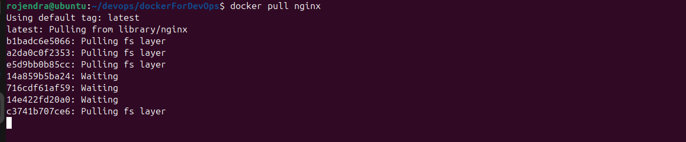
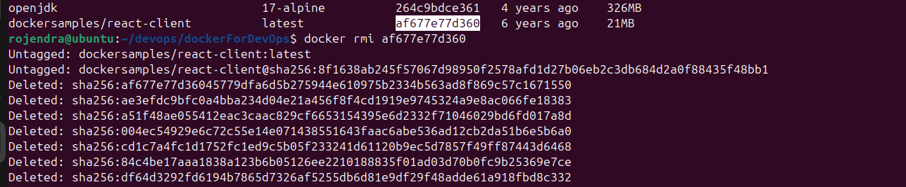
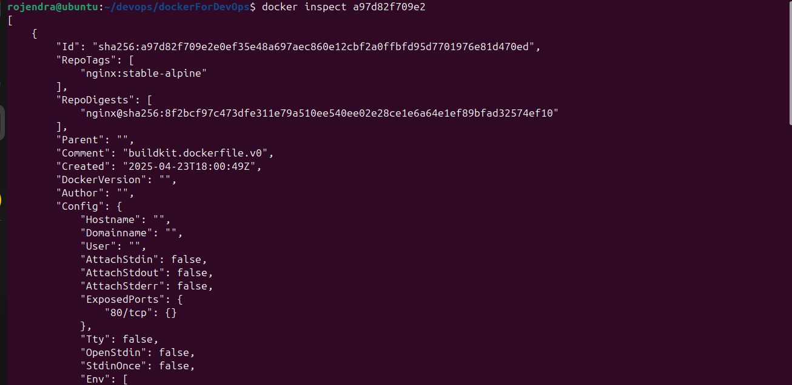

## Managing Images
Quickly manage Docker images: list, pull, remove, and inspect them.

*Example output of running `images`.*
   - `docker images`  - "List all downloaded images"
```bash
   docker images

 ```
  
    

*Example output of running `nginx`.*
   - `docker pull nginx`  - "Download an image from Docker Hub"
```bash
   docker pull nginx

 ```
  
    

*Example output of running `docker rmi`.*
   - `docker rmi <image_id> `   "Remove an image"
```bash
   docker rmi af677e77d360 
```
  
   

*Example output of running `docker inspect`.*
   - `docker inspect <image_id>` - "View detailed image info"
```bash
   docker inspect a97d82f709e2
```
  
 
